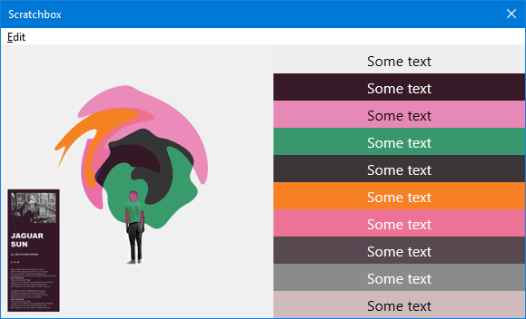

**Properties**

|||||
|---|---|---|---|
|Height|`number`|read|
|Path|`string`|read|This will the source path of the image when created from the various album art methods or [utils.LoadImage](../namespaces/utils.md#utilsloadimagepath-max_size). It will be empty if the image is cloned or created with [utils.CreateImage](../namespaces/utils.md#utilscreateimagewidth-height).|
|Width|`number`|read|

**Methods**

## `Clone()`
Returns a `JsImage` instance.

## `CreateBitmap()`
Return an [JsBitmap](JsBitmap.md) instance.

!!! example
	```js
	var g_bitmap = null;

	function update_bitmap() {
		if (g_bitmap) {
			g_bitmap = null;
		}

		var handle = fb.GetNowPlaying();

		if (handle) {
			var image = handle.GetAlbumArt(0); // 0 = front
			if (image) {
				g_bitmap = image.CreateBitmap();
			}
		}
	}
	```

See also: [utils.LoadBitmap](../namespaces/utils.md#utilsloadbitmappath-max_size).

## `FlipRotate(options)`
|Arguments|||
|---|---|---|
|options|[WICBitmapTransform](../flags.md#wicbitmaptransform)|

No return value.

## `GetColourScheme(count)`
|Arguments|||
|---|---|---|
|count|`number`|

Returns an array.

!!! note
	This uses the `KMeans` algorithm internally so should produce similar results to
	`GetColourSchemeJSON` from other components except it returns the colours only
	without the frequency.

!!! example
	=== "Code"
		```js
		'use strict';

		include(fb.ComponentPath + 'helpers.js');

		// Tracks playlist selection

		var img = null;
		var colours = [];
		on_item_focus_change();

		function on_item_focus_change() {
			if (img) {
				img = null;
			}

			colours = [];
			var metadb = fb.GetFocusItem();

			if (metadb) {
				img = metadb.GetAlbumArt(); // omitting the type defaults to front

				if (img) {
					colours = img.GetColourScheme(10);
				}
			}
			window.Repaint();
		}

		function on_paint(gr) {
			if (img && colours.length) {
				gr.DrawImage(img, 0, 0, 300, 300, 0, 0, img.Width, img.Height);

				colours.forEach(function (colour, i) {
					gr.FillRectangle(300, i * 30, window.Width - 300, 30, colour);

					/*
					The 2nd WriteTextSimple arg is the font. Leaving it as an empty string so defaults of Segoe UI and 16px are used.

					See helpers.js in the component directory for the DetermineTextColour function
					which calculates whether to use black or white for the text colour depending on
					the background colour.
					*/
					gr.WriteTextSimple('Some text', '', DetermineTextColour(colour), 300, i * 30, window.Width - 300, 30, 2, 2);
				});
			}
		}

		function on_playlist_switch() {
			on_item_focus_change();
		}
		```
	=== "Result"
		

## `GetGraphics()`
Return an [JsGraphics](JsGraphics.md) instance.

## `ReleaseGraphics()`
No return value.

## `Resize(width, height)`
|Arguments|||
|---|---|---|
|width|`number`|
|height|`number`|

No return value.

## `SaveAs(path)`
|Arguments|||
|---|---|---|
|path|`string`|The parent folder must already exist. The image is saved as `JPG` so you should use that as the file extension.|

Returns a `boolean` value to indicate success.

## `StackBlur(radius)`
|Arguments|||
|---|---|---|
|radius|`number`|Valid values `2`-`254`.|

No return value.

!!! example
	```js
	include(fb.ComponentPath + 'helpers.js');

	var img = utils.LoadImage(fb.ComponentPath + 'samples\\images\\1.webp');
	var blur_img = null;
	var radius = 20;

	StackBlur(radius);

	function StackBlur(radius) {
		blur_img = img.Clone();
		blur_img.StackBlur(radius);
	}

	function on_paint(gr) {
		gr.DrawImage(img, 0, 0, 550, 368, 0, 0, 550, 368);
		gr.DrawImage(blur_img, 0, 368, 550, 368, 0, 0, 550, 368);
		gr.FillRectangle(0, 0, window.Width, 24, RGB(0, 0, 0));
		gr.WriteText('Scroll mouse to change radius: ' + radius, '', RGB(255, 255, 255), 0, 0, window.Width, 24, 2, 0);
	}

	function on_mouse_wheel(step) {
		radius += step * 5;
		if (radius < 2)
			radius = 2;
		if (radius > 254)
			radius = 254;
		StackBlur(radius);
		window.Repaint();
	}
	```
