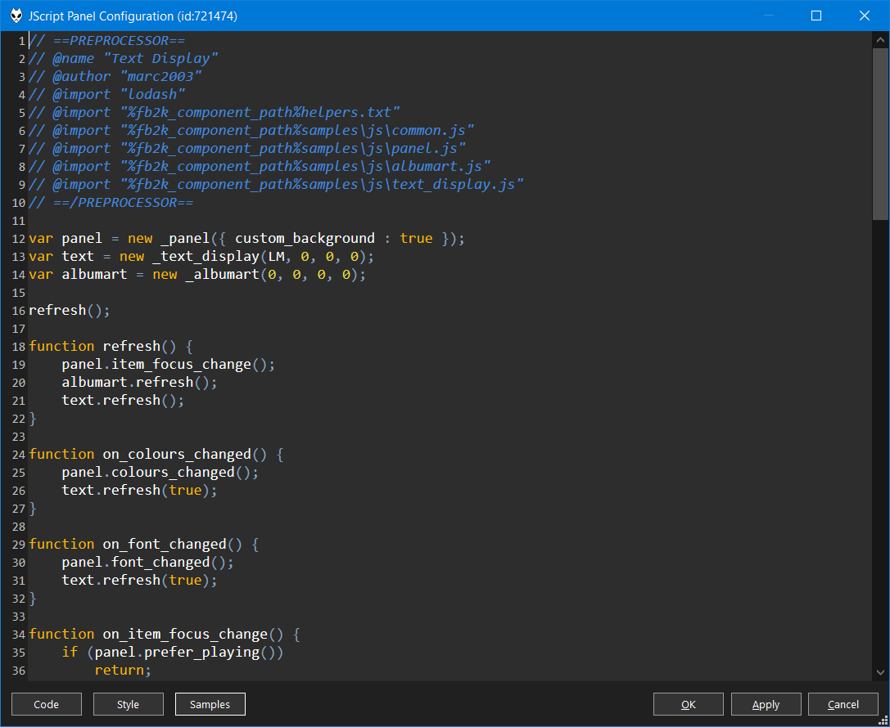

Right click any panel>`Configure` to open the `Configuration Window`.

!!! note
	Some scripts may implement their own menu without a `Configure` option. If
	this happens, you can hold down the ++shift+windows++ keys and then right
	click. This always brings up the default menu.

Using the `Code` button you can access the following commands which should be
self-explanatory.

- `Reset`
- `Import`
- `Export`

Use the `Style` button to change the [Editor Properties](#editor-properties).

Use the `Samples` button to quickly choose any of the included scripts.

## Keyboard shortcuts
|||
|---|---|
|++ctrl+'0'++|Reset zoom. Change using ++ctrl++ and the mouse wheel.|
|++ctrl+'F'++|Open`Find` dialog|
|++ctrl+'G'++|Open `Go To Line` dialog|
|++ctrl+'H'++|Open `Replace` dialog|
|++ctrl+'S'++|Apply|
|++f3++|Find next|
|++shift+f3++|Find previous|

## Editor Properties

For `styles`, you can combine any of the following options
separated by a comma.

||
|---|
|font:NAME|
|size:PIXELS|
|bold|
|italics|
|fore:HEX_COLOUR|
|back:HEX_COLOUR|

Hex colours must be the full 6 digits like `#FF0000`.

`colour.caret.fore` and `colour.selection.back` can be hex colours only.
