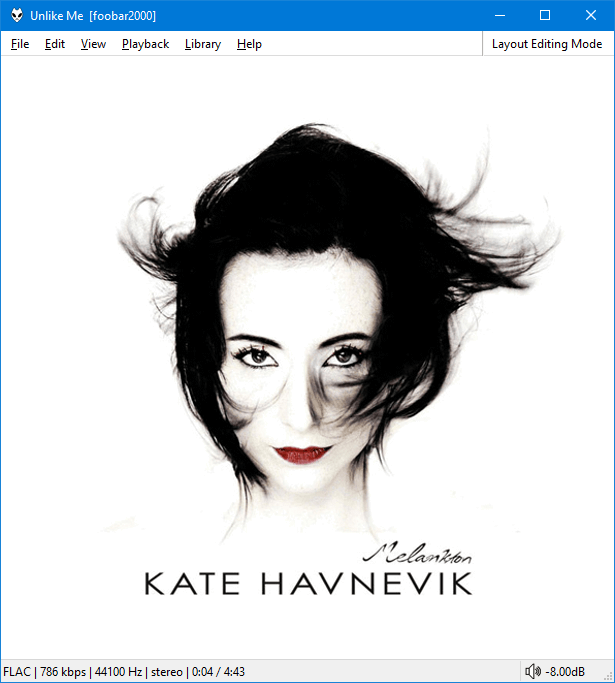

# Album Art

This has full parity with `Default UI` / `Columns UI` panels where:

- The patterns/stub images set in the main `Preferences` are used.
- The `Prefer larger / Prefer external / Prefer embedded` options found under `File>Preferences>Advanced>Display>Album Art` are respected.
- Exotic image formats are supported if you have the relevant `WIC` codecs installed.
- Displaying images from certain online sources is supported.

## Bonus features
- You can right click the panel>`Refresh` after changing any `Preferences` or adding/removing art from a folder/file.
- Images can be cropped without stretching
- Customisable double click action to always open image internally, externally or opening the containing folder.
- Tooltips indicate the original size and path of the image. They even support `Dark Mode`.
- Search `Google` images using `%album artist%` / `%album%` tags.

## Limitations
- Does not support `Library viewer` selections. Options are playlist based.
