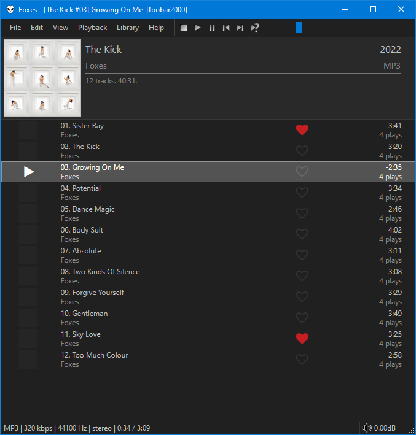

This was originally created by [Br3tt aka Falstaff](https://www.deviantart.com/br3tt).

## Clickable ratings
!!! note
	The behaviour of clickable ratings depend on the presence of `foo_playcount`. When installed,
	`Playback Statistics` will be used. Without it, `RATING` tags are written
	to your files.

## Features
- Full drag/drop including to external panels.
- Customisable group headers with optional front cover display.
- Smooth Scrolling.
- Arrange columns using drag/drop.
- Change colours and fonts in [foobar2000](https://www.foobar2000.org) `Preferences` > `Display` > `DefaultUI` or `ColumsUI`.
- Alternatively, you can configure independent custom colours from the right click menu.
- Create custom columns with title formatting and full `$rgb` support.
- The `MOOD` and `RATING` columns do not support `$rgb` so their colours can be configured independently via the right click menu.
- There is a `Enable Dynamic` colour option. Colours are extracted from the album art of the currently playing track. If active, custom colours / `$rgb` are ignored.
- Playlist specific fields like `%list_index%`, `%list_total%`, `%isplaying%`, `%queue_index%` etc are fully supported.
- Optional playlist info header.
- Use album art or a custom image as background wallpaper.
- Use the middle click mouse button or ++tab++ to open the built in `Playlist Manager`. This has advanced features
 such as the ability to sort playlists by name and apply [playlist locks](../images/playlist-lock.png).
- Check the right click menu and `Panel settings` for all options.
- Right click on the columns toolbar to toggle columns on/off. Use the main `Panel settings` to customise them.
- Use ++ctrl+'T'++ to toggle the columns toolbar.
- Use ++ctrl+'I'++ to toggle the playlist info panel.
- Use ++ctrl+'C'++, ++ctrl+'X'++, ++ctrl+'V'++ to copy/cut/paste using the `Windows Clipboard`. Clipboard contents can now be pasted in `Windows Explorer`.
- Use ++'F2'++ to rename active playlist in playlist manager panel.
- Use ++'F5'++ to refresh covers.
