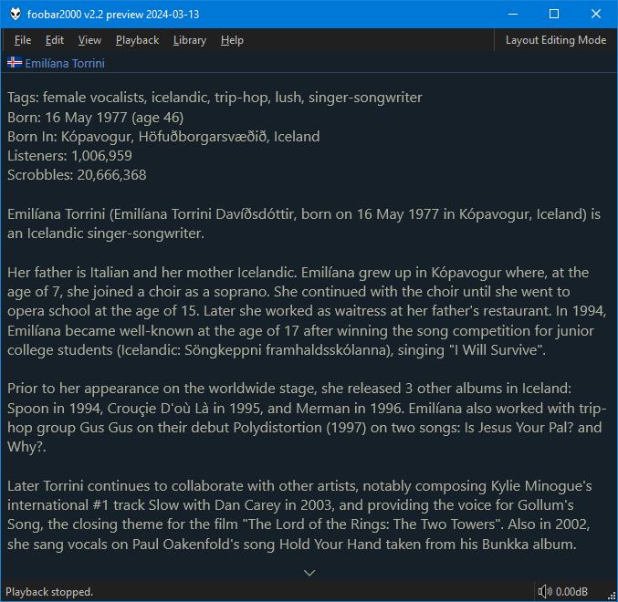
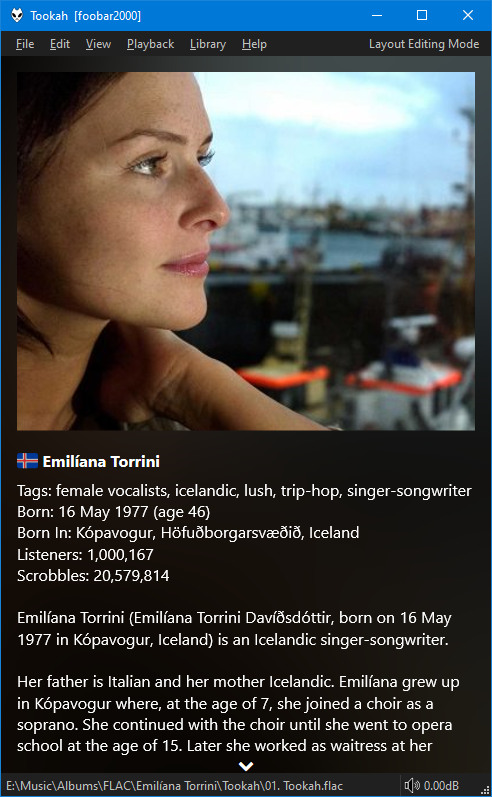

# Last.fm Bio

=== "Last.fm Bio"
	

=== "Last.fm Bio + Images"
	

Performs lookups using `$meta(artist,0)` for the best results. Language
can be changed via the right click menu.

Displaying [Country flags](../guides/country-flags.md) is supported. See
the linked page for the required font.

Title format is preferred and can be set via the right
click menu but values can be scraped from the `Born In` section
shown on the above example.
