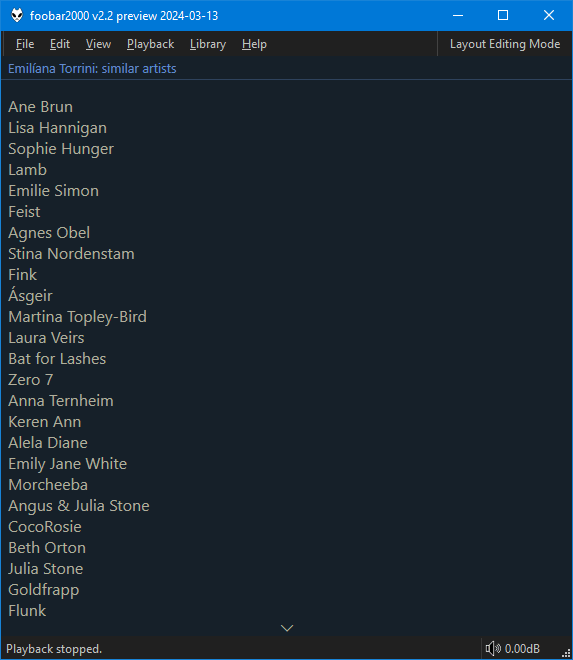
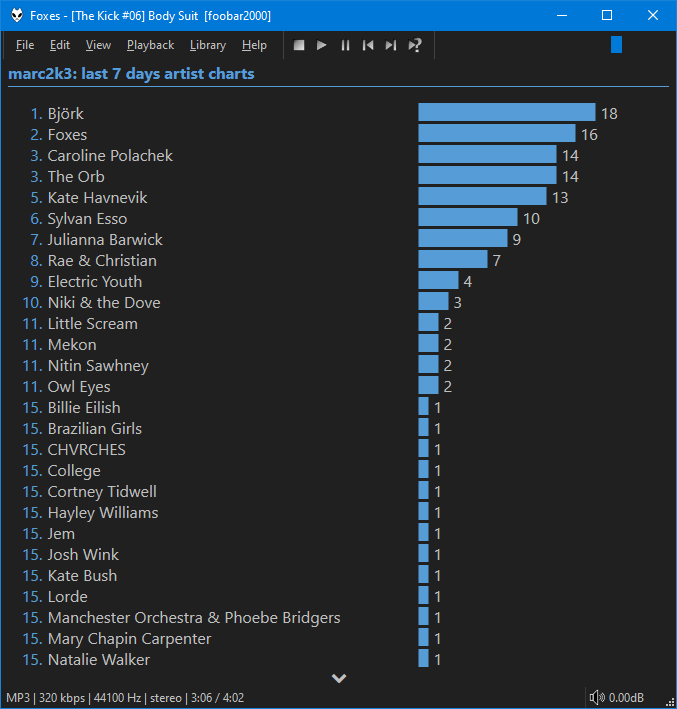

=== "Artist"
	

=== "User"
	

## Artist mode
Performs lookups using `$meta(artist,0)` for the best results. Can display `Similar Artists`,
`Top Tracks` and `Top Tags`.

## User mode
You'll need to right click and enter your [Last.fm](https://www.last.fm) username to
display charts and recent tracks.
