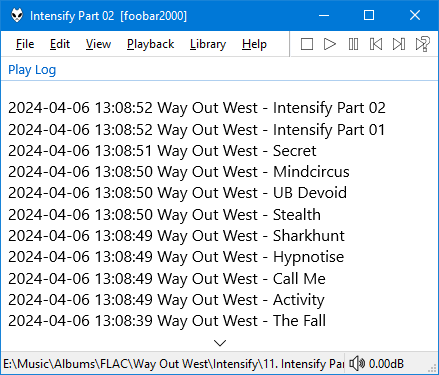

This logs all plays as playback begins. It supports dynamic artist/titles
from streams and the title format pattern can be configured from the
right click menu. Checks are in place to make sure entries are not duplicated.

New entries are inserted at the beginning of the file
and the date/time is written.

There are menu options to set the entry `Limit` and to `Clear`
the log.

The file is saved inside your `foobar2000` profile as
`js_data\play_log.txt`.
