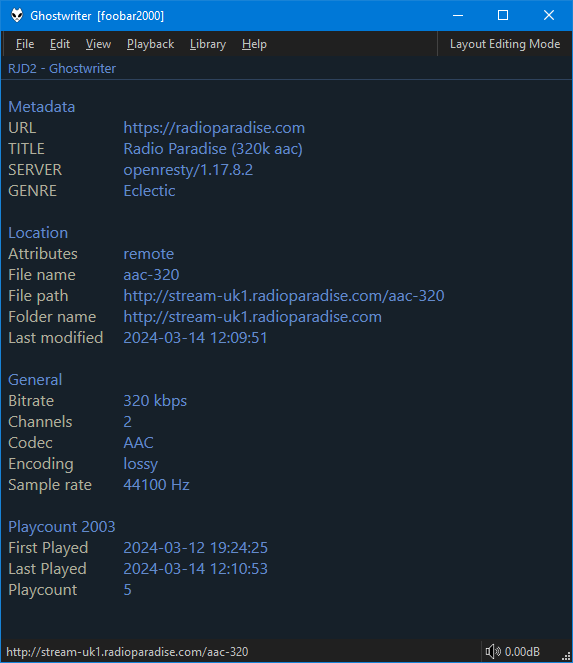

=== "Properties"
	

=== "Other Info"
	

## Properties
The tag values in the `Metadata` section are clickable and will
create `Autoplaylists`. The one exception is where recognised `MusicBrainz IDs`
are transformed in to website urls so you can click and read more.

## Other Info
The `General` and `Location` sections should be same as from the `Properties`
dialog. Additional information from `Playback Statistics` and 3rd party
components will be exposed if available.
