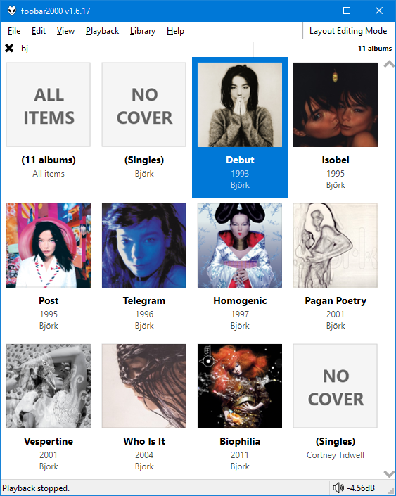

This was originally created by [Br3tt aka Falstaff](https://www.deviantart.com/br3tt).

=== "Grid"
	

=== "List"
	

!!! note
	Performance may appear sluggish on first run/scrolling through new items
	as copies of the album art are resized and cached. Subsequent loading
	should be faster.

## Common Features
- 2 display modes avaliable:
    * List
    * Grid

- Smooth scrolling.
- Change colours and fonts in [foobar2000](https://www.foobar2000.org) `Preferences` > `Display` > `DefaultUI` or `ColumsUI`.
- Alternatively, you can configure independent custom colours from the right click menu.
- You can also enable dynamic colours extracted from the front cover of the playing item.
- Use ++ctrl+'T'++ to toggle the info bar.
- Use ++ctrl++ + mouse wheel to zoom.

## Library only features
- Use the right click menu to add to current/new/other playlists.
- Double click to send to playlist and play or just send without playing. Check the right click menu for [options](../images/smooth-browser-playlist-options.png).
- 3 group modes are available:
    * Album (it is expected that compilation albums have a common `Album Artist` tag)
    * Artist
    * Album Artist
- Filter box with full `Media Library` query support.
- Multiple selections with the ++ctrl++ / ++shift++ keys are supported.

## Playlist only features
- Grouping is by `Album` only.
- Single click highlights the selected `Album` in your playlist viewer.
- Double click starts playback from the first track of the selected `Album`.
