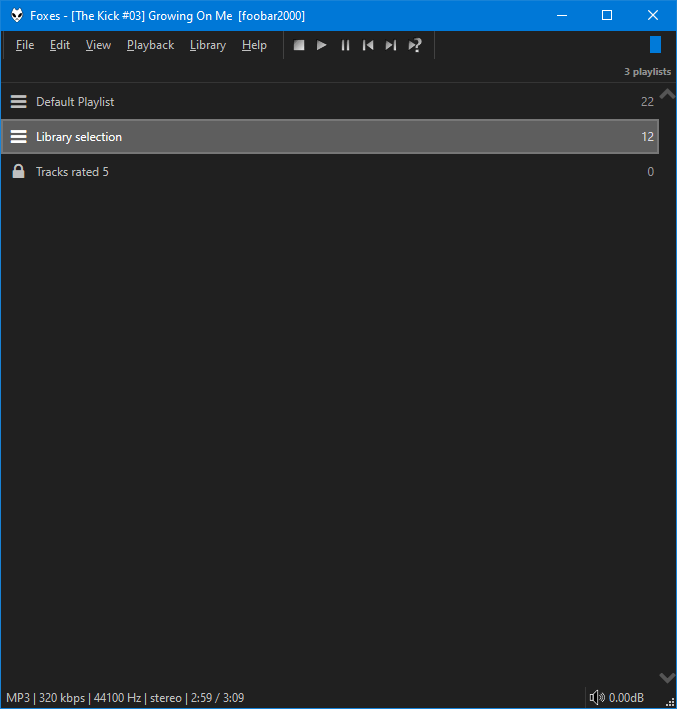

This was originally created by [Br3tt aka Falstaff](https://www.deviantart.com/br3tt).

## Features
- Order playlists by dragging items with the mouse. Multi-select is not supported.
- Sort all playlists by name using the right click menu.
- Apply [playlist locks](../images/playlist-lock.png).
- Restore deleted playlists which remain for the lifetime of the current [foobar2000](https://www.foobar2000.org) session.
- Cover art or custom image as background supported (including a blur effect).
- Smooth scrolling.
- Change colours and fonts in [foobar2000](https://www.foobar2000.org) `Preferences` > `Display` > `DefaultUI` or `ColumsUI`.
- Alternatively, you can configure independent custom colours from the right click menu.
- You can also enable dynamic colours extracted from the front cover of the playing item.
- Use ++ctrl+'T'++ to toggle the info bar.
- Use ++ctrl++ + mouse wheel to zoom.
