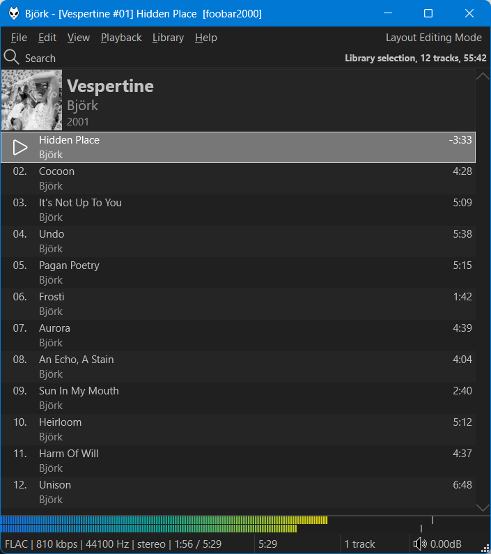

This was originally created by [Br3tt aka Falstaff](https://www.deviantart.com/br3tt).

## Features
- Variable height group headers with album art. Right click the header bar or scrollbar to change options/turn off grouping.
- Cover art or custom image as background supported (including a blur effect).
- Smooth scrolling.
- Change colours and fonts in [foobar2000](https://www.foobar2000.org) `Preferences` > `Display` > `DefaultUI` or `ColumsUI`.
- Alternatively, you can configure independent custom colours from the right click menu.
- You can also enable dynamic colours extracted from the front cover of the playing item.
- Use ++ctrl+'T'++ to toggle the info bar.
- Use ++ctrl++ + mouse wheel to zoom.
- Use ++ctrl+'C'++, ++ctrl+'X'++, ++ctrl+'V'++ to copy/cut/paste using the `Windows Clipboard`. Clipboard contents can now be pasted in `Windows Explorer`.
- Playlist search behaves similarly	to the native `foobar2000` playlist search where matching items are highlighted in the playlist. Press ++'F3'++ to jump to the next result.

## Limitations
- This is very basic and is in no way equivalent to a proper playlist viewer.
