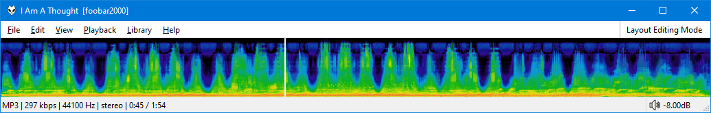

This script requires `ffmpeg` to decode the audio track and generate the
image which is cached and used as the background for the seekbar.

For obvious reasons, only local files with a known length are supported.

## Setup
You can download ffmpeg from here.

[https://www.gyan.dev/ffmpeg/builds/](https://www.gyan.dev/ffmpeg/builds/)

For best results `ffmpeg` `6.0` or later should be used.

By default, the script will look for it inside your [foobar2000](https://www.foobar2000.org) profile
folder. If you wish to change this, edit the script where there is a note next to it.

See here for available `ffmpeg` options which can be set via the right click menu.

[https://ffmpeg.org/ffmpeg-filters.html#showspectrumpic](https://ffmpeg.org/ffmpeg-filters.html#showspectrumpic)

Do not set `legend` as that is already disabled.
