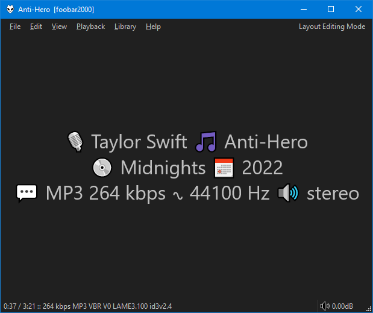
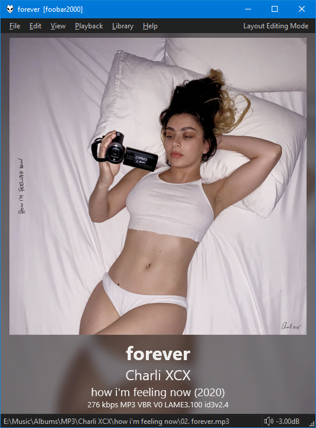

=== "Text only"
	

=== "Album Art top, Text bottom"
	

These are just some of the options available via the right click menu:

- Text alignment.
- Album Art and/or blurred background.
- Per-second updates.
- Custom background colour independent of UI colour.

## Title Formatting
[Playlist only fields](https://wiki.hydrogenaud.io/index.php?title=Foobar2000:Title_Formatting_Reference#Playlist-only_fields) like `%list_index%`, `%list_total%`, etc are supported.

A custom `$font` function and `$rgb` are also supported. You can read more [here](../docs/guides/font-rgb.md).

Also, you can check [Country Flags](../docs/guides/country-flags.md) if you store countries in your tags.

`%jsp3_playlist_name%` should be self explanatory.

Finally ,`$jsp3_since` can display the difference between now and a given date/time string.
Use with `Playback Statistics` `%last_played%` or similar.

```
$jsp3_since(%last_played%)
```

could display something like `5wk 2d`.

## Limitations
Unlike the original `foo_textdisplay` component there is no support for clickable links. Also,
there are no scrollbars. Use the mouse wheel to scroll when there is too much content to
fit in the panel.
