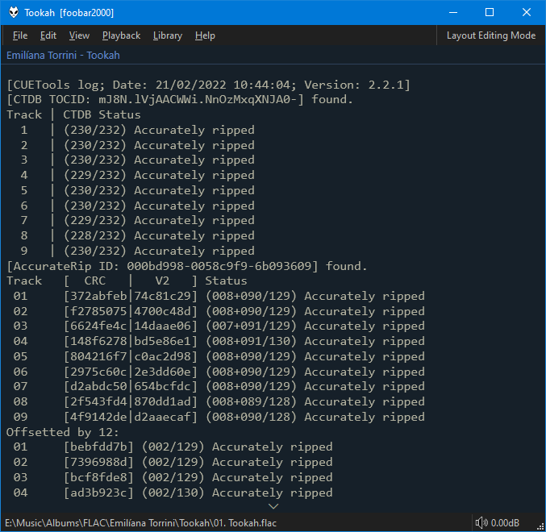

Use this for displaying the contents of text files. The
path used and title are fully customisable with
title formatting. You can also specify a folder path
and the first `txt` or `log` file within will be
displayed.
