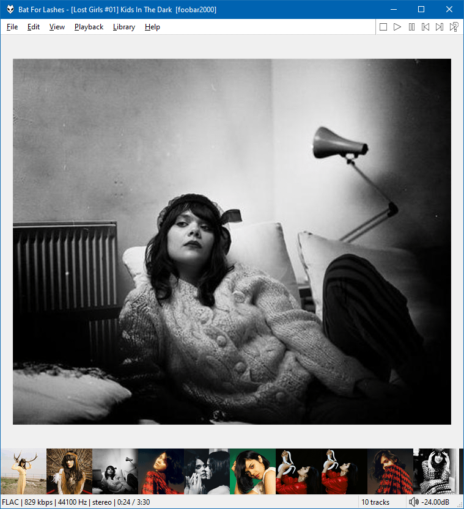

!!! note
	The latest versions limit themselves to loading no more than 64MB
	of files from disk. This is to prevent out of memory errors
	that may have adverse affects on the stability/performance of the whole
	application.

By default it will display multiple images (if present) inside the same folder as the
playling/selected file. The folder path can be configured via the right click menu.

Alternatively, you can put it [Last.fm](https://www.last.fm) mode and it can download artist images.
Automatic downloads are enabled by defaul but that can be turned off and you may trigger
downoads manually.

There are many options for thumbnail size and alignment via the right click menu. Circular thumbnails
can also be enabled.
